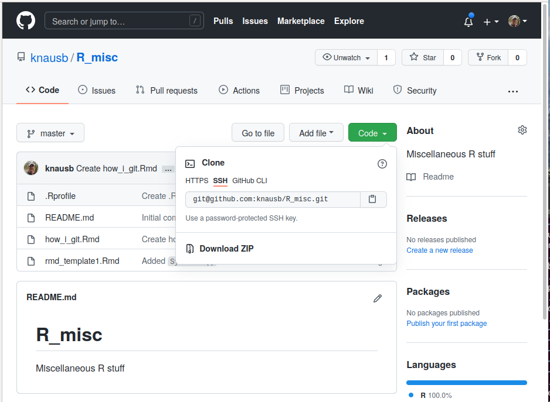
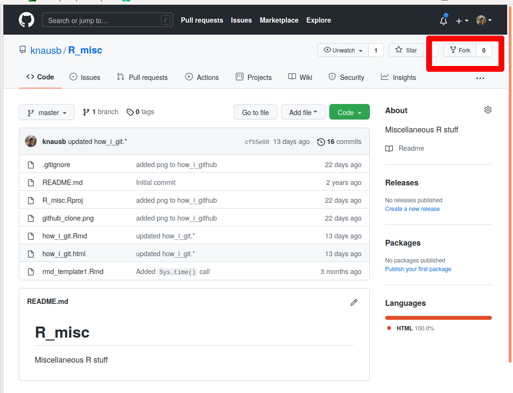

```{r setup, include=FALSE}
knitr::opts_chunk$set(echo = TRUE)
```


## Aquiring a repository


When I see a repository on GitHub that I'm interested in I'll do one of two things.
Typically I'll just clone it and use their code.
If I think I'd like to contribute, I'll fork it and then clone my fork.
I think the important difference is that I can make changes to my fork but can't if I just clone someone else's repository.
More information can be found at [The difference between forking and cloning a repository](https://github.community/t/the-difference-between-forking-and-cloning-a-repository/10189).


Once I've decided I'd like to clone a GitHub repository I look for a button that allows me to copy the ssh information.
These days there is a 'Code' button with a dropdown menu.


```{r, out.width="80%", fig.cap="**Figure X.** Example of clone information.", prompt=TRUE, echo=FALSE}
options(prompt = 'R> ')

```


Once copied to the clipboard I can use the following to clone the repository to a local volume.


```
bash$ git clone git@github.com:knausb/R_misc.git
```


This will create a directory called ```R_misc``` which contains the repo.


```{bash}
git status
```


Here it tells me that I'm on the branch named 'master' (note that newer instances use 'main' as the default branch now).
It also tells me if I've modified any files that I need to commit.
It also gives me hints on commands that it thinks might help me.


## Forking a repository


```{r, out.width="80%", fig.cap="**Figure X.** Example of fork information.", prompt=TRUE, echo=FALSE}

```


## Editing files


Text files can be created and deleted with your favorite text editor.
Once editing is complete you can check the repository again with `git status`.
We'll then want to add them and then commit them with a message describing the changes.


```{bash}
git add how_i_git.*
git commit -m "made important changes to how_i_git"
git status
```


## Remotes


When working with remotes, such as GitHub, you'll want to update your changes there as well.
This will allow you to share your code with others, and allow others to contribute to your code.
We'll accomplish this by pushing our changes to the remote.
But first we need to pull from the remote.
This will update our copy with any changes that have been made to the remote since we last updated our version.
This is important here because sometimes this requires a manual curation step by a human.
We can then push our changes to incorporate them into the remote.


```
git pull origin master
git push origin master
```

## Branches


```
git branch -a

$ git checkout -b iss53
Switched to a new branch "iss53"


```


## Working with R packages


```


devtools::test()

# RStudio 'check' button
devtools::check(document = FALSE)
devtools::check(document = TRUE)

roxygen2::roxygenise()
roxygen2::roxygenise(clean = TRUE)

# RStudio 'install and restart'
R CMD INSTALL --no-multiarch --with-keep.source GAPIT3documentation

# rm man/*
# rm Meta/*

```


```
R CMD build
R CMD check
R CMD check --as-cran

```


## Links


[git Book](https://git-scm.com/book/en/v2), note translations to other spoken languages.


